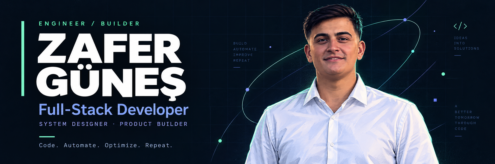

 

  

Building software products, systems and automation that solve real problems.

01 — PROFILE

I’m a Full-Stack Developer, System Designer and Product Builder focused on turning real operational problems into complete software products.

I work across the stack — from architecture and data modeling to frontend, backend, infrastructure, automation and deployment.

I’m particularly interested in software that removes repetitive work, simplifies complex workflows and remains maintainable as the product grows.

PROBLEM
   │
   ├── Understand the real requirement
   │
   ├── Design the system
   │
   ├── Build the product
   │
   ├── Automate what can be automated
   │
   └── Ship → Measure → Improve

02 — WHAT I BUILD

<table>
<tr>
<td width="33%" valign="top">

◈ Product Engineering

Complete products from idea to production.

Web · Mobile · Desktop · SaaS

</td>
<td width="33%" valign="top">

◈ Systems & Backend

APIs, databases, architecture and reliable services.

Node.js · PostgreSQL · Prisma

</td>
<td width="33%" valign="top">

◈ AI & Automation

Software that reduces repetitive operational work.

LLM · Automation · Intelligent Workflows

</td>
</tr>
</table>

03 — CURRENTLY BUILDING

Workforce Management Platform

Emektra is a multi-platform workforce management product designed for businesses working with seasonal, daily and distributed workers.

The goal is straightforward: make workforce operations easier to manage, automate and scale.

Core Areas

Workforce

Operations

Payments

People & teams

Attendance

Worker payments

Worker records

Daily operations

Operational workflows

Workforce organization

Process tracking

Management

Platform

                 EMEKTRA
                    │
       ┌────────────┼────────────┐
       │            │            │
      WEB          MOBILE      DESKTOP
       │            │            │
       └────────────┼────────────┘
                    │
                NODE.JS API
                    │
                POSTGRESQL
                    │
                 DOCKER

I’m also exploring AI-driven automation systems for eliminating repetitive business processes through intelligent workflows.

04 — TECH STACK

Frontend

Backend & Data

Infrastructure & Tools

AI & Automation

LLM Integrations · AI-Assisted Development · Workflow Automation

05 — ENGINEERING PRINCIPLES

<table>
<tr>
<td>01</td>
<td><b>Understand before building.</b> Good software starts with the real problem, not the first implementation idea.</td>
</tr>
<tr>
<td>02</td>
<td><b>Prefer clarity over complexity.</b> Architecture should make systems easier to understand, change and operate.</td>
</tr>
<tr>
<td>03</td>
<td><b>Automate repetitive work.</b> If a process happens repeatedly, it is a candidate for better tooling.</td>
</tr>
<tr>
<td>04</td>
<td><b>Build for the next version.</b> Maintainability matters as much as getting the first version shipped.</td>
</tr>
<tr>
<td>05</td>
<td><b>Ship real software.</b> A solution has value when it survives production and solves the problem it was built for.</td>
</tr>
</table>

06 — GITHUB

  

07 — LET'S CONNECT

  

Code.   Automate.   Optimize.   Repeat.

